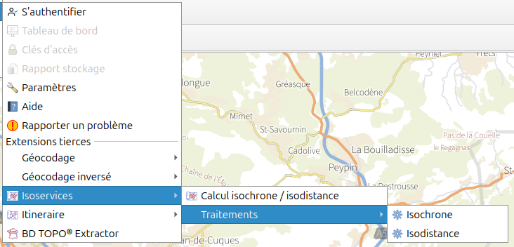

# Intégration d'extension tierces

L'extension Géoplateforme a été pensée comme un point d'entrée pour la mise en avant d'extensions QGIS tierces qui utilisent les données ou les API de la Géoplateforme.

Lors de l'installation de l'extension vous aurez la possibilité d'installer des extensions recommandées :


Cela correspond aux [extensions listées comme dépendances](https://github.com/Geoplateforme/plugin-qgis-geoplateforme/blob/main/geoplateforme/metadata.txt#L28) :

| Service | Plugin intégré |
|:------- | :------------- |
| API de géocodage et de géocodage inversé | [French Locator Filter](https://plugins.qgis.org/plugins/french_locator_filter/) |
| API de navigation pour des calculs d'itinéraire, d'isochrone et d'isodistance | [GPF - Isochrone Isodistance Itinéraire](https://plugins.qgis.org/plugins/gpf_isochrone_isodistance_itineraire/) |

Si vous acceptez leur installation, des menus complémentaires seront disponibles dans l'extension Géoplateforme, correspondant à leurs capacités :



----

## Référencement de votre extension dans le plugin Géoplateforme

Les demandes d'ajout d'une extension comme recommendation par l'extension Géoplateforme doivent être traité via l'ouverture d'un ticket dans GitHub.

```{button-link} https://github.com/Geoplateforme/plugin-qgis-geoplateforme/issues/new?template=20_integration_request.yml
:color: primary
:shadow:
:expand:
:tooltip: Forumaire de référencement de plugin tiers

{far}`rectangle-list` Faire une demande de référencement de son plugin tiers
```

Vous devez décrire votre extension, son utilisation de la Géoplateforme et indiquer si elle répond aux critères de référencement.

### Critères de référencement

- {far}`square-check` le code source est sous une licence libre compatible avec QGIS (GPL2+ généralement)
- {far}`square-check` le code source est librement accessible
- {far}`square-check` l'auteur déclaré dans le fichier metadata.txt est l'interlocuteur technique avec qui échanger sur l'intégration
- {far}`square-check` les versions supportées de QGIS (`qgisMinimumVersion` et `qgisMaximumVersion`) par le plugin Géoplateforme font partie de celles supportées par le plugin tiers
- {far}`square-check` le plugin packagé publié sur un dépôt de plugins en accès public. Idéalement le [dépôt officiel des extensions de QGIS](https://plugins.qgis.org/).
- {far}`square-check` le périmètre fonctionnel est complémentaire avec celui du plugin Géoplateforme (sans recouvrement)
- {far}`square-check` les appels aux APIs de la Géoplateforme sont conformes aux conditions d'utilisation : rate limiting, authentification, cas d'usage autorisé...

### Intégration technique

Une fois votre demande validée, voici les étapes nécessaires pour finaliser l'intégration dans l'extension Géoplateforme.

#### Modifications dans le plugin Géoplateforme 
Les modifications décrites ci-dessous doivent faire l'objet de pull-requests proposées par vos soins

1. Ajouter le plugin à la liste `plugin_dependencies` dans `geoplateforme/metadata.txt`

    ```ini
    plugin_dependencies=French Locator Filter,GPF - Isochrone Isodistance Itinéraire, Mon extension géoplateforme
    ```

    Cela correspond au nom affiché dans la recherche des extensions QGIS, défini dans la balise `name` de votre `metadata.txt`.

1. Ajout du nom technique de votre plugin dans la constante `GPF_PLUGIN_LIST` dans `geoplateforme/constants.py`

    ```py
    GPF_PLUGIN_LIST: list[str] = [
        "french_locator_filter",
        "gpf_isochrone_isodistance_itineraire",
        "my_geoplateforme_extension"
    ]
    ```

    Attention, cela ne correspond pas au nom affiché dans les extension QGIS mais au nom du répertoire contenu dans l'archive de votre extension.

    Ceci est nécessaire si vous souhaitez que des actions de votre extension soient ajoutées dans l'extension Géoplateforme.

#### Modifications à faire dans le plugin tiers

Si vous souhaitez ajouter des actions de votre extension dans l'extension Géoplateforme, il est nécessaire d'ajouter la fonction `create_gpf_plugins_actions` dans la classe de votre extension.
Cette fonction n'empêche pas une installation de votre plugin indépendamment du plugin Qgis Geoplateforme.

Voici un exemple :

```python
def create_gpf_plugins_actions(self, parent: QWidget) -> list[QAction]:
    """Create action to be inserted a Geoplateforme plugin

    :param parent: parent widget
    :type parent: QWidget
    :return: list of action to add in Geoplateforme plugin
    :rtype: list[QAction]
    """
    available_actions = []
    action_my_widget = QAction(
            self.tr("Mon composant graphique Géoplateforme"),
            self.iface.mainWindow(),
        )
    action_my_widget.triggered.connect(
        self._display_my_widget
    )
    return available_actions
```

Vous pouvez trouver des exemples plus complets dans les dépôts du [French Locator Filter](https://gitlab.com/Oslandia/qgis/french_locator_filter/-/blob/master/french_locator_filter/plugin_main.py) et de [GPF - Isochrone Isodistance Itinéraire](https://github.com/Geoplateforme/plugin-qgis-gpf-isochrone-isodistance-itineraire/blob/main/gpf_isochrone_isodistance_itineraire/plugin_main.py)
